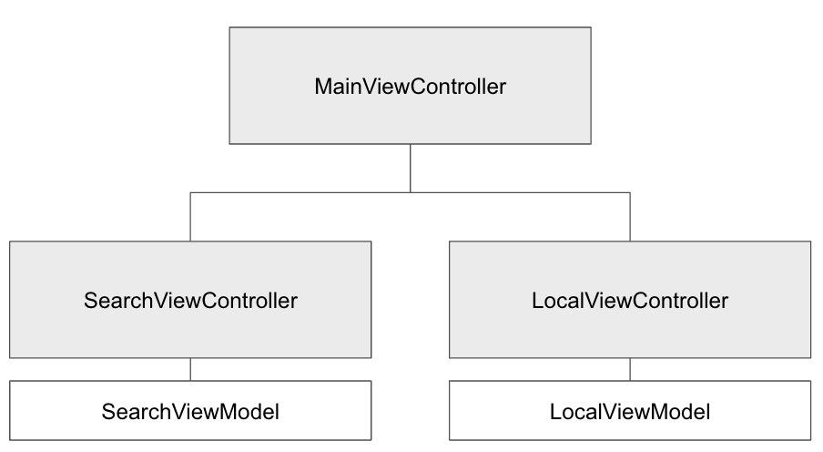
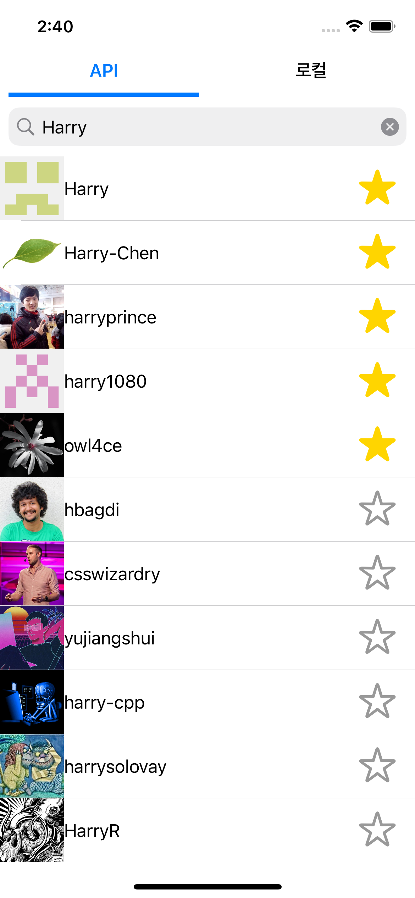

# github-api-sample

### 개요
- Github API를 활용한 User 정보 검색 및 저장용 앱

&nbsp 

### 개발시기
-  2022.03

#### API
- 활용 API 사이트 : https://api.github.com/search/

### 앱 기능
#### ViewController
- MainViewController
  - Tabbar를 이용해 SearchViewController, LocalViewController 를 전환

- SearchViewController
  - 검색창에 검색어 입력시, 1.5초 간격으로 마지막 글자 체크 후 Search API 호출
  - 호출 성공시,User List를 tableView에 표시
  - 즐겨찾기 버튼 클릭시, Local에 해당 유저 정보를 저장
  - 이미 저장 된 즐겨찾기 클릭시, Local에서 유저 정보를 제거
  - MVVM 패턴 적용

- LocalViewController
  - 검색창에 검색어 입력시, 즉시 검색된 Local User 정보를 표시
  - Local에 저장된 User의 정보를 Section으로 구분하여 표시
  - 즐겨찾기 클릭시, Local에 즉시 유저 정보를 제거
  - MVVM 패턴 적용
#### CocoaPods
| 이름 | 설명 |
|---|:---:|
| RxSwift | Reactive Programming 을 위한 Swift용 Library |
| RxCocoa | UIKit에 RxSwift 적용을 위한 Library |
| RxDataSources | TableView 에서 Data 전달 및 Section 처리를 위한 Library |
| Alamofire | API 통신 Library |
| Tabman | Tabbar 구현을 위한 Library |
| SnapKit | programmatically autolayout 적용을 위한 Library |
| Kingfisher | Image Download, Show Library |

### 앱 실행 예시

&nbsp

&nbsp

